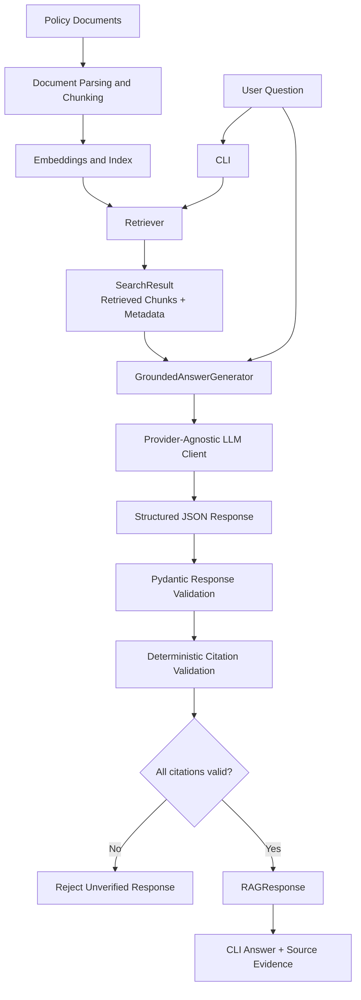
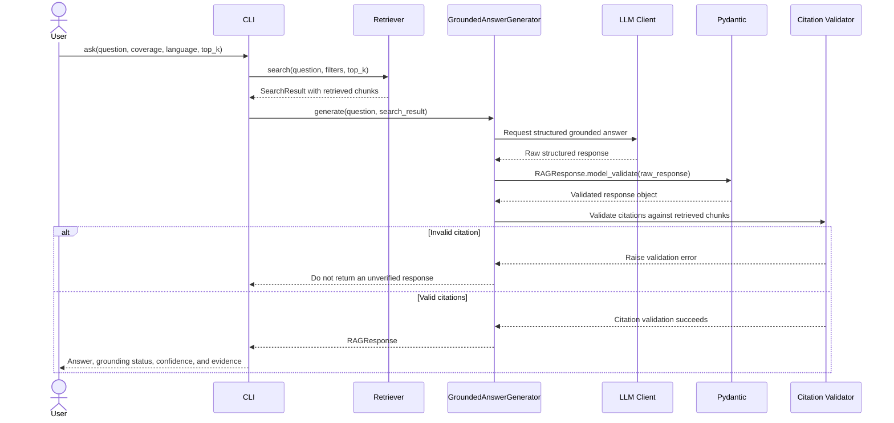
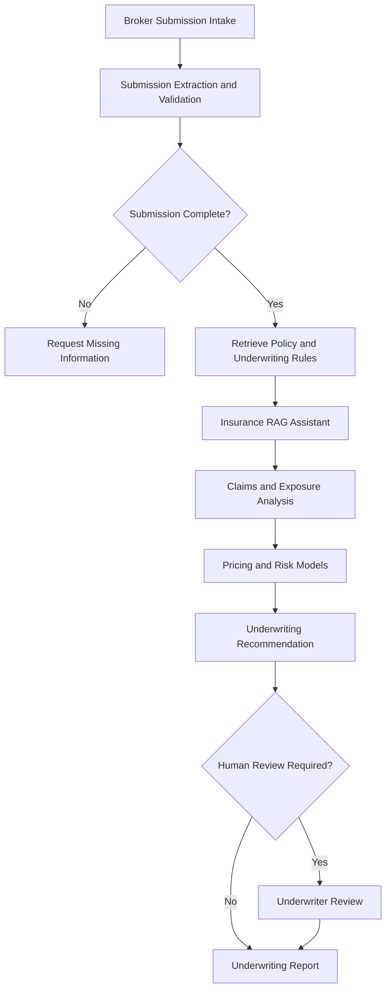

# System Architecture

## Purpose

This document describes the architecture of the **Insurance RAG Assistant**.

The application answers questions about insurance policy wording from an indexed document corpus. It retrieves relevant policy chunks, asks a provider-agnostic LLM client to produce a structured response, and deterministically verifies that each citation refers to retrieved source text.

The project is designed as the insurance knowledge layer of a future agentic underwriting platform. Its purpose is to make policy information easier to locate and inspect; it does not make underwriting decisions, claims decisions, pricing decisions, or binding determinations of coverage.

## Design Goals

The system is built around five goals:

- **Grounded answers:** Answer from retrieved policy passages rather than general model knowledge.
- **Traceability:** Link material statements to document, section, chunk, and supporting quotation.
- **Deterministic controls:** Treat model output as untrusted until it passes schema and citation checks.
- **Separation of concerns:** Keep retrieval, generation, validation, provider integration, and CLI rendering independent.
- **Safe failure:** Reject unsupported citations rather than display them as verified policy evidence.

## High-Level Architecture



The retrieval stage supplies the only policy context that the answer generator may rely on. The generation stage returns structured output, not free-form terminal text. The final response is shown only after citation validation succeeds.

## Main Components

| Component | Responsibility | Provider-Specific |
|---|---|---:|
| `cli.py` | Parses commands, constructs the application flow, and renders the answer and citations | No |
| `config.py` | Loads and validates runtime configuration from environment variables | No |
| `llm/base.py` | Defines the common contract implemented by LLM clients | No |
| `llm/factory.py` | Selects and constructs the configured LLM client | No |
| `retrieval/` | Retrieves policy chunks for the question and optional filters | No |
| `models/retrieval.py` | Defines retrieval contracts such as chunks, metadata, and search results | No |
| `generation/prompts.py` | Defines instructions for source-grounded, structured responses | No |
| `generation/answer_generator.py` | Generates `RAGResponse` objects and validates citations | No |
| `models/response.py` | Defines Pydantic contracts for answers and citations | No |
| `data/` | Stores authorized source documents, generated chunks, and index artifacts | No |
| `tests/` | Covers retrieval contracts, response validation, citation validation, and CLI behavior | No |

The business layer depends on the LLM client contract rather than a provider SDK. Provider changes must not require changes to retrieval contracts, response schemas, citation checks, or CLI rendering.

## Query Sequence



## Retrieval Architecture

The retriever operates on chunks rather than full documents. Each retrieved chunk must preserve enough source metadata to support downstream validation and user-facing evidence.

A retrieval result should contain at least:

| Field | Purpose |
|---|---|
| `chunk_id` | Stable identifier for the exact retrieved passage |
| `document_id` | Stable identifier for the source policy document/version |
| `document_name` | Human-readable source document name |
| `section_title` | Policy section containing the chunk |
| `text` | Original chunk text used for retrieval and quote validation |
| `score` | Retrieval or reranking score, when available and meaningful |

The embedding model uses **768 dimensions**. The same embedding configuration must be used when indexing source chunks and embedding user queries. A change to the model, dimensionality, chunking strategy, or normalization pipeline requires a new index version.

Policy documents should be versioned by product, effective date, jurisdiction, language, and source revision. A RAG answer is only as reliable as the version of the policy text supplied to retrieval.

## Generation and Response Contract

The answer generator receives the user question and a `SearchResult`. It instructs the LLM to use only the retrieved chunks and to return a structured response containing:

- The natural-language answer.
- A grounding status.
- A confidence level.
- A list of citations.
- For each citation: the chunk ID, document metadata, section title, and a supporting quotation.

The LLM is responsible for synthesis. It may combine information from multiple chunks, such as a coverage grant, deductible, and vacancy condition. It must not create a citation to evidence outside the retrieved context.

Pydantic validates the response shape before source validation begins. Schema-valid output alone is not considered evidence of correctness.

## Citation Validation Layers

The application applies distinct validation layers. Each one addresses a different failure mode and should remain separate.

| Layer | Purpose | Example failure caught |
|---|---|---|
| Retrieval contract validation | Ensure the application has identifiable source chunks | A chunk without a stable identifier or original text |
| LLM structured output | Convert question and passages into a known response shape | Malformed JSON or missing citation field |
| Pydantic validation | Enforce the response schema and types | An invalid confidence value or citation object |
| Citation provenance validation | Require citations to reference current retrieval context | A model-invented `chunk_id` |
| Metadata validation | Require citation metadata to match the cited chunk | A real chunk ID paired with the wrong section title |
| Verbatim quote validation | Require the quoted evidence to be present in the source chunk | A plausible but paraphrased quotation |

### Verbatim Quote Validation

For each generated citation, `GroundedAnswerGenerator._validate_citations()`:

1. Finds the cited `chunk_id` in the current `SearchResult`.
2. Rejects the citation if that chunk was not retrieved.
3. Normalizes the generated quote and source text for limited harmless Unicode differences.
4. Verifies that the normalized quote is a contiguous substring of the normalized source chunk.
5. Verifies the citation's document ID, document name, and section title against the retrieved chunk.

The text normalization is intentionally narrow. It handles typographic variants such as non-breaking spaces, curly apostrophes, quotation marks, and dash characters. It must not become a semantic-similarity check: it does not remove words, alter meaning, or accept a paraphrase as a verbatim quotation.

```text
Accepted after typography normalization
Source:    fire-protection systems
Generated: fire‑protection systems

Rejected as a paraphrase
Source:    sudden and accidental escape of water
Generated: sudden plumbing leak damage
```

## Security Boundaries

```text
Tracked by Git
- Source code
- Tests
- Synthetic or authorized sample policy documents
- Documentation
- Evaluation fixtures and expected results
- .env.example
- uv.lock

Never tracked by Git
- .env files
- API keys and provider credentials
- Customer policyholder data
- Claims files and personal information
- Confidential policy wordings without authorization
- Generated local indexes when they contain restricted content
- Evaluation outputs containing sensitive data
```

The application must not send real policyholder, claim, or confidential policy data to an external LLM provider without documented authorization, access controls, privacy review, contractual safeguards, and retention controls.

## Failure Handling

The system must fail safely when it cannot demonstrate evidence for an answer.

| Condition | Required behavior |
|---|---|
| No relevant retrieved evidence | Return an explicit, non-speculative response or `grounded=false` according to the response contract |
| Unknown citation chunk | Reject the generated response |
| Mismatched citation metadata | Reject the generated response |
| Paraphrased or unsupported quote | Reject the generated response |
| Malformed LLM output | Reject it at Pydantic validation and surface a controlled error |
| Provider outage | Surface a controlled operational error; do not substitute a fabricated answer |

In development, citation-validation failures should include diagnostic context such as the generated quote and a bounded source excerpt. In a user-facing environment, log the technical detail securely and return a clear non-technical message instead of a traceback.

## Future Underwriting Workflow

The Insurance RAG Assistant is intended to become the policy-knowledge component of a larger underwriting workflow.



The Insurance RAG Assistant provides cited document evidence to downstream stages. It must not independently accept, decline, price, bind, or settle insurance business.
