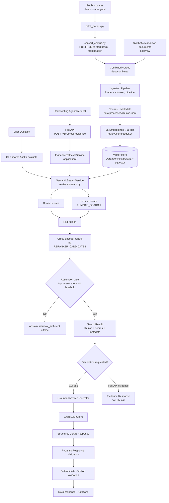
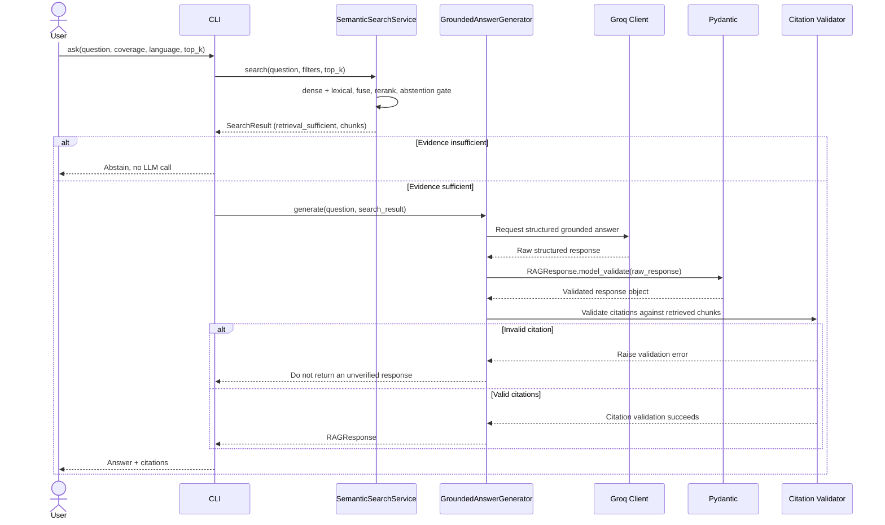
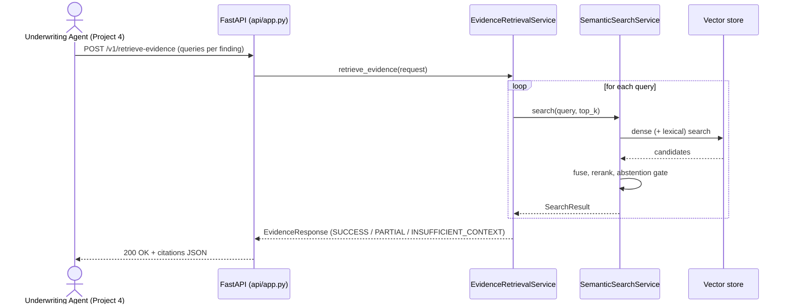

# System Architecture

## Purpose

This document describes the architecture of the **Insurance Knowledge Agent (Insurance RAG Assistant)**.

The application answers questions about insurance and insurance-regulation documents from an indexed corpus. It retrieves relevant chunks with hybrid (dense + lexical) search, reranks them with a cross-encoder, abstains when the evidence is weak, and optionally asks a provider-agnostic LLM client (Groq) to produce a structured response whose citations are deterministically validated.

The project is Project 3 of a five-project insurance agentic AI portfolio and serves as the insurance knowledge layer of the broader underwriting platform. Its purpose is to make document information easier to locate and inspect; it does not make underwriting decisions or coverage determinations.

## Design Goals

- **Grounded answers:** answer from retrieved passages rather than general model knowledge.
- **Traceability:** link material statements to document, section, chunk, and supporting quotation.
- **Deterministic controls:** treat model output as untrusted until it passes schema and citation checks.
- **Separation of concerns:** keep ingestion, embeddings, vector storage, retrieval, reranking, generation, validation, and API rendering independent.
- **Safe failure:** abstain or reject rather than present unsupported content as verified evidence.
- **Service boundary:** downstream agents consume evidence through a versioned HTTP API rather than accessing the vector store directly.
- **Swappable infrastructure:** the vector backend (Qdrant or pgvector) and the LLM provider are replaceable behind interfaces.

## High-Level Architecture

```mermaid
flowchart TD
    S[Public sources<br/>data/sources.yaml] --> F[fetch_corpus.py]
    F --> CV[convert_corpus.py<br/>PDF/HTML to Markdown + front matter]
    CV --> A
    SY[Synthetic Markdown documents<br/>data/raw] --> A[Combined corpus<br/>data/combined]

    A --> B[Ingestion Pipeline<br/>loaders, chunker, pipeline]
    B --> C[Chunks + Metadata<br/>data/processed/chunks.jsonl]
    C --> D[E5 Embeddings, 768-dim<br/>retrieval/embedder.py]
    D --> E[(Vector store<br/>Qdrant or PostgreSQL + pgvector)]

    Q[User Question] --> G[CLI: search / ask / evaluate]
    H[Underwriting Agent Request] --> I[FastAPI<br/>POST /v1/retrieve-evidence]

    G --> J[SemanticSearchService<br/>retrieval/search.py]
    I --> K[EvidenceRetrievalService<br/>application/]
    K --> J
    E --> J

    J --> D1[Dense search]
    J --> D2[Lexical search<br/>if HYBRID_SEARCH]
    D1 --> RRF[RRF fusion]
    D2 --> RRF
    RRF --> RR[Cross-encoder rerank<br/>top RERANKER_CANDIDATES]
    RR --> GATE{Abstention gate<br/>top rerank score >= threshold}
    GATE -- No --> AB[Abstain: retrieval_sufficient = false]
    GATE -- Yes --> L[SearchResult<br/>chunks + scores + metadata]

    L --> M{Generation requested?}
    M -- CLI ask --> N[GroundedAnswerGenerator]
    N --> O[Groq LLM Client]
    O --> P[Structured JSON Response]
    P --> V1[Pydantic Response Validation]
    V1 --> V2[Deterministic Citation Validation]
    V2 --> U[RAGResponse + Citations]

    M -- FastAPI evidence --> V[Evidence Response<br/>no LLM call]
```

The retrieval stage supplies the only context the answer generator may rely on. The FastAPI path returns raw evidence without any LLM call, while the CLI `ask` path additionally synthesizes a structured, cited answer. Hybrid search and reranking are controlled by configuration; with both off, the pipeline reduces to dense search with a similarity-threshold gate.

## Retrieval Pipeline

| Stage | Behavior | Setting |
|---|---|---|
| Dense search | Cosine similarity over normalized E5 vectors | always on |
| Lexical search | Keyword ranking over chunk text; results carry a lexical score and rank | `HYBRID_SEARCH` |
| Fusion | Reciprocal Rank Fusion of the dense and lexical rankings | `HYBRID_SEARCH` |
| Reranking | Cross-encoder `mmarco-mMiniLMv2-L12-H384-v1` rescoring of the fused candidates | `RERANKER`, `RERANKER_CANDIDATES` |
| Abstention | If the top rerank score is below the threshold, no result is considered sufficient | `RERANK_ABSTENTION_SCORE` |
| Metadata filters | Coverage, jurisdiction, language, document type, version | request parameters |

Each returned chunk carries its vector score, lexical score and rank, RRF score, and rerank score, so ranking decisions can be inspected.

A reranker can only reorder the candidates it receives. If the right chunk is outside the candidate pool, it cannot be recovered; hybrid search widens the pool with lexical matches. In evaluation, 20 candidates with hybrid search outperformed both dense-only retrieval and a pool of 100 (see [evaluation-baseline.md](evaluation-baseline.md)).

## Main Components

| Component | Responsibility | Provider-Specific |
|---|---|---:|
| `cli.py` | Parses commands (`ingest`, `search`, `ask`, `evaluate`, `version`), constructs the application flow, renders answers and citations | No |
| `config.py` | Loads runtime configuration from environment variables and `.env` (backend, hybrid, reranker, threshold, database URL, Groq) | No |
| `api/app.py`, `routes.py`, `dependencies.py` | FastAPI application exposing `/health` and `/v1/retrieve-evidence` | No |
| `api/schemas/evidence.py` | HTTP request/response contracts for evidence retrieval | No |
| `application/evidence_retrieval_service.py` | Orchestrates multi-query evidence retrieval for the API layer | No |
| `ingestion/loaders.py` | Loads Markdown documents with YAML front matter | No |
| `ingestion/chunker.py` | Creates section-aware chunks with section path metadata | No |
| `ingestion/pipeline.py` | Coordinates the end-to-end ingestion workflow | No |
| `ingestion/` converters | Convert source PDF/HTML into Markdown (PyMuPDF, BeautifulSoup) | No |
| `scripts/fetch_corpus.py` | Downloads public documents listed in `data/sources.yaml` and writes a manifest with URL, date, and SHA-256 | No |
| `scripts/convert_corpus.py` | Converts downloaded sources to Markdown and validates them with the project loader and chunker | No |
| `scripts/calibrate_threshold.py` | Computes abstention thresholds from labelled evaluation cases | No |
| `retrieval/embedder.py` | Generates normalized 768-dimensional E5 embeddings | No |
| `retrieval/protocols.py` | `VectorStore` and `Reranker` interfaces | No |
| `retrieval/factory.py` | Selects the vector store from `VECTOR_BACKEND` | No |
| `retrieval/vector_store.py` | Qdrant implementation | Qdrant |
| `retrieval/pg_store.py` | PostgreSQL + pgvector implementation (dense and lexical search) | PostgreSQL |
| `retrieval/reranker.py` | Cross-encoder reranker | No |
| `retrieval/search.py` | Orchestrates dense/lexical search, fusion, reranking, filtering, and abstention | No |
| `llm/base.py`, `fake.py`, `groq_client.py` | LLM contract, deterministic test double, and Groq implementation | Groq only in `groq_client.py` |
| `generation/prompts.py`, `answer_generator.py` | Source-grounded prompts; `RAGResponse` generation and citation validation | No |
| `models/` | Pydantic contracts for documents, retrieval results, and responses | No |
| `evaluation/evaluator.py` | Retrieval, section-level, abstention, and optional generation evaluation | No |
| `evaluation/cases.json`, `cases_real.json` | Labelled evaluation sets (synthetic and public documents) | No |

The business layer depends on the LLM client contract and the `VectorStore`/`Reranker` protocols rather than provider SDKs. Provider changes must not require changes to retrieval contracts, response schemas, citation checks, CLI rendering, or the FastAPI evidence contract.

## Vector Backends

| Backend | Use | Notes |
|---|---|---|
| Qdrant (default) | Local persistent store in `vector_store/qdrant` | Dense search with metadata filters |
| PostgreSQL 17 + pgvector | `VECTOR_BACKEND=pgvector`, started with `compose.pg.yaml` | Dense and lexical search in one database; the configuration used for the published evaluation |

Switching backend requires re-ingesting the corpus into the new store.

## Query Sequence (CLI ask)

```mermaid
sequenceDiagram
    actor User
    participant CLI
    participant Retriever as SemanticSearchService
    participant Generator as GroundedAnswerGenerator
    participant LLM as Groq Client
    participant Schema as Pydantic
    participant Validator as Citation Validator

    User->>CLI: ask(question, coverage, language, top_k)
    CLI->>Retriever: search(question, filters, top_k)
    Retriever->>Retriever: dense + lexical, fuse, rerank, abstention gate
    Retriever-->>CLI: SearchResult (retrieval_sufficient, chunks)
    alt Evidence insufficient
        CLI-->>User: Abstain, no LLM call
    else Evidence sufficient
        CLI->>Generator: generate(question, search_result)
        Generator->>LLM: Request structured grounded answer
        LLM-->>Generator: Raw structured response
        Generator->>Schema: RAGResponse.model_validate(raw_response)
        Schema-->>Generator: Validated response object
        Generator->>Validator: Validate citations against retrieved chunks
        alt Invalid citation
            Validator-->>Generator: Raise validation error
            Generator-->>CLI: Do not return an unverified response
        else Valid citations
            Validator-->>Generator: Citation validation succeeds
            Generator-->>CLI: RAGResponse
        end
        CLI-->>User: Answer + citations
    end
```

## Evidence Retrieval Sequence (FastAPI)

```mermaid
sequenceDiagram
    actor Client as Underwriting Agent (Project 4)
    participant API as FastAPI (api/app.py)
    participant Service as EvidenceRetrievalService
    participant Retriever as SemanticSearchService
    participant Store as Vector store

    Client->>API: POST /v1/retrieve-evidence (queries per finding)
    API->>Service: retrieve_evidence(request)
    loop for each query
        Service->>Retriever: search(query, top_k)
        Retriever->>Store: dense (+ lexical) search
        Store-->>Retriever: candidates
        Retriever->>Retriever: fuse, rerank, abstention gate
        Retriever-->>Service: SearchResult
    end
    Service-->>API: EvidenceResponse (SUCCESS / PARTIAL / INSUFFICIENT_CONTEXT)
    API-->>Client: 200 OK + citations JSON
```

No LLM call occurs on this path; the response contains only retrieved evidence and metadata.

## Citation Validation Layers

| Layer | Purpose | Example failure caught |
|---|---|---|
| Retrieval contract validation | Ensure the application has identifiable source chunks | A chunk without a stable identifier or original text |
| LLM structured output | Convert question and passages into a known response shape | Malformed JSON or missing citation field |
| Pydantic validation | Enforce the response schema and types | An invalid confidence value or citation object |
| Citation provenance validation | Require citations to reference current retrieval context | A model-invented `chunk_id` |
| Metadata validation | Require citation
