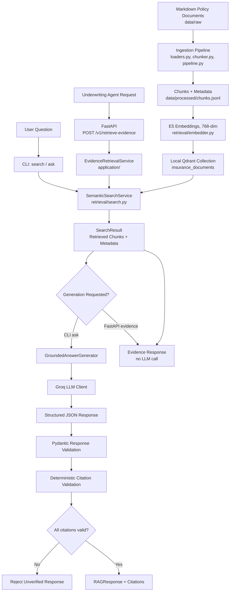
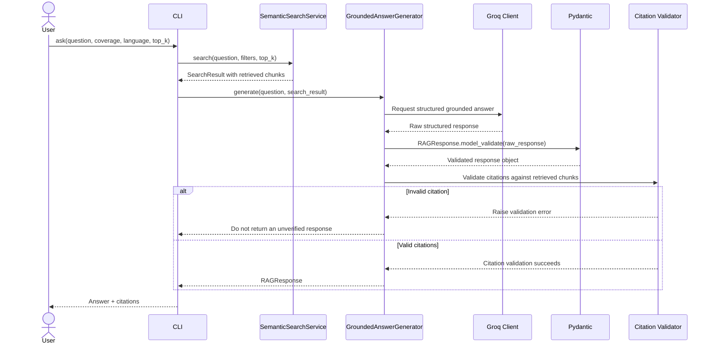
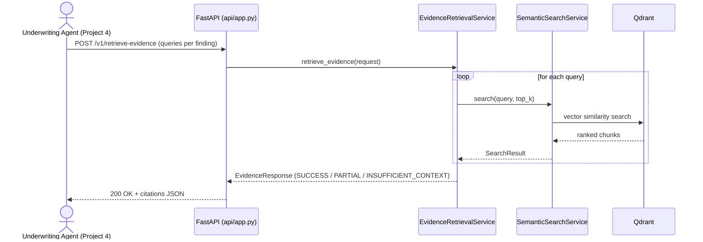
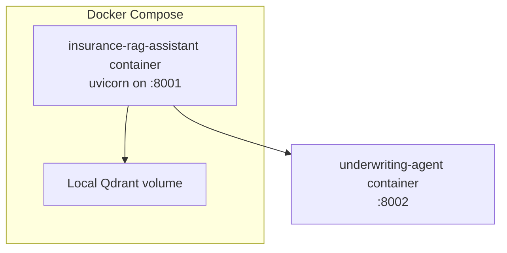

# System Architecture

## Purpose

This document describes the architecture of the **Insurance Knowledge Agent (Insurance RAG Assistant)**.

The application answers questions about insurance policy wording from an indexed document corpus stored in a local Qdrant vector store. It retrieves relevant policy chunks, asks a provider-agnostic LLM client (Groq) to produce a structured response, and deterministically verifies that each citation refers to retrieved source text. It also exposes a FastAPI evidence-retrieval endpoint consumed directly by the Underwriting Agent (Project 4), without requiring an LLM call.

The project is Project 3 of a five-project insurance agentic AI portfolio and serves as the insurance knowledge layer of the broader underwriting platform. Its purpose is to make policy information easier to locate and inspect; it does not make underwriting decisions, claims decisions, pricing decisions, or binding determinations of coverage.

## Design Goals

- **Grounded answers:** answer from retrieved policy passages rather than general model knowledge.
- **Traceability:** link material statements to document, section, chunk, and supporting quotation.
- **Deterministic controls:** treat model output as untrusted until it passes schema and citation checks.
- **Separation of concerns:** keep ingestion, embeddings, vector storage, retrieval, generation, validation, and API rendering independent.
- **Safe failure:** reject unsupported citations rather than display them as verified policy evidence.
- **Service boundary:** downstream agents consume evidence through a versioned HTTP API rather than accessing Qdrant directly.

## High-Level Architecture


```mermaid
flowchart TD
    A[Markdown Policy Documents<br/>data/raw] --> B[Ingestion Pipeline<br/>loaders.py, chunker.py, pipeline.py]
    B --> C[Chunks + Metadata<br/>data/processed/chunks.jsonl]
    C --> D[E5 Embeddings, 768-dim<br/>retrieval/embedder.py]
    D --> E[Local Qdrant Collection<br/>insurance_documents]

    F[User Question] --> G[CLI: search / ask]
    H[Underwriting Agent Request] --> I[FastAPI<br/>POST /v1/retrieve-evidence]

    G --> J[SemanticSearchService<br/>retrieval/search.py]
    I --> K[EvidenceRetrievalService<br/>application/]
    K --> J
    E --> J
    J --> L[SearchResult<br/>Retrieved Chunks + Metadata]

    L --> M{Generation Requested?}
    M -- CLI ask --> N[GroundedAnswerGenerator]
    N --> O[Groq LLM Client]
    O --> P[Structured JSON Response]
    P --> Q[Pydantic Response Validation]
    Q --> R[Deterministic Citation Validation]
    R --> S{All citations valid?}
    S -- No --> T[Reject Unverified Response]
    S -- Yes --> U[RAGResponse + Citations]

    M -- FastAPI evidence --> V[Evidence Response<br/>no LLM call]
    L --> V
```

The retrieval stage supplies the only policy context the answer generator may rely on. The FastAPI path returns raw evidence without any LLM call, while the CLI `ask` path additionally synthesizes a structured, cited answer.

## Main Components

| Component | Responsibility | Provider-Specific |
|---|---|---:|
| `cli.py` | Parses commands (`ingest`, `search`, `ask`, `evaluate-retrieval`), constructs the application flow, and renders answers and citations | No |
| `config.py` | Loads and validates runtime configuration from environment variables | No |
| `api/app.py` | FastAPI application exposing `/health` and `/v1/retrieve-evidence` | No |
| `api/routes.py` | Defines HTTP route handlers | No |
| `api/dependencies.py` | Wires services into FastAPI dependency injection | No |
| `api/schemas/evidence.py` | HTTP request/response contracts for evidence retrieval | No |
| `application/evidence_retrieval_service.py` | Orchestrates multi-query evidence retrieval for the API layer | No |
| `ingestion/loaders.py` | Loads Markdown source documents | No |
| `ingestion/chunker.py` | Creates overlapping chunks with metadata | No |
| `ingestion/pipeline.py` | Coordinates the end-to-end ingestion workflow | No |
| `retrieval/embedder.py` | Generates normalized 768-dimensional E5 embeddings | No |
| `retrieval/vector_store.py` | Persists and queries the local Qdrant collection | No |
| `retrieval/search.py` | Applies metadata filters, ranks chunks, enforces relevance threshold | No |
| `llm/base.py` | Defines the common LLM client contract | No |
| `llm/fake.py` | Deterministic LLM behavior for tests | No |
| `llm/groq_client.py` | Implements the LLM client contract using Groq | Yes |
| `generation/prompts.py` | Defines instructions for source-grounded, structured responses | No |
| `generation/answer_generator.py` | Generates `RAGResponse` objects and validates citations | No |
| `models/documents.py` | Defines document and chunk metadata contracts | No |
| `models/retrieval.py` | Defines retrieval contracts such as chunks and search results | No |
| `models/response.py` | Defines Pydantic contracts for answers and citations | No |
| `evaluation/evaluator.py` | Runs retrieval and generation evaluation | No |

The business layer depends on the LLM client contract rather than a provider SDK. Provider changes must not require changes to retrieval contracts, response schemas, citation checks, CLI rendering, or the FastAPI evidence contract.

## Query Sequence (CLI ask)


```mermaid
sequenceDiagram
    actor User
    participant CLI
    participant Retriever as SemanticSearchService
    participant Generator as GroundedAnswerGenerator
    participant LLM as Groq Client
    participant Schema as Pydantic
    participant Validator as Citation Validator

    User->>CLI: ask(question, coverage, language, top_k)
    CLI->>Retriever: search(question, filters, top_k)
    Retriever-->>CLI: SearchResult with retrieved chunks
    CLI->>Generator: generate(question, search_result)
    Generator->>LLM: Request structured grounded answer
    LLM-->>Generator: Raw structured response
    Generator->>Schema: RAGResponse.model_validate(raw_response)
    Schema-->>Generator: Validated response object
    Generator->>Validator: Validate citations against retrieved chunks
    alt Invalid citation
        Validator-->>Generator: Raise validation error
        Generator-->>CLI: Do not return an unverified response
    else Valid citations
        Validator-->>Generator: Citation validation succeeds
        Generator-->>CLI: RAGResponse
    end
    CLI-->>User: Answer + citations
```

## Evidence Retrieval Sequence (FastAPI)


```mermaid
sequenceDiagram
    actor Client as Underwriting Agent (Project 4)
    participant API as FastAPI (api/app.py)
    participant Service as EvidenceRetrievalService
    participant Retriever as SemanticSearchService
    participant Qdrant

    Client->>API: POST /v1/retrieve-evidence (queries per finding)
    API->>Service: retrieve_evidence(request)
    loop for each query
        Service->>Retriever: search(query, top_k)
        Retriever->>Qdrant: vector similarity search
        Qdrant-->>Retriever: ranked chunks
        Retriever-->>Service: SearchResult
    end
    Service-->>API: EvidenceResponse (SUCCESS / PARTIAL / INSUFFICIENT_CONTEXT)
    API-->>Client: 200 OK + citations JSON
```

No LLM call occurs on this path; the response contains only retrieved evidence and metadata.

## Citation Validation Layers

| Layer | Purpose | Example failure caught |
|---|---|---|
| Retrieval contract validation | Ensure the application has identifiable source chunks | A chunk without a stable identifier or original text |
| LLM structured output | Convert question and passages into a known response shape | Malformed JSON or missing citation field |
| Pydantic validation | Enforce the response schema and types | An invalid confidence value or citation object |
| Citation provenance validation | Require citations to reference current retrieval context | A model-invented `chunk_id` |
| Metadata validation | Require citation metadata to match the cited chunk | A real chunk ID paired with the wrong section title |
| Verbatim quote validation | Require the quoted evidence to be present in the source chunk | A plausible but paraphrased quotation |

### Verbatim Quote Validation

For each generated citation, `GroundedAnswerGenerator._validate_citations()`:

1. Finds the cited `chunk_id` in the current `SearchResult`.
2. Rejects the citation if that chunk was not retrieved.
3. Normalizes the generated quote and source text for limited harmless Unicode differences.
4. Verifies that the normalized quote is a contiguous substring of the normalized source chunk.
5. Verifies the citation's document ID, document name, and section title against the retrieved chunk.

The text normalization is intentionally narrow. It handles typographic variants such as non-breaking spaces, curly apostrophes, quotation marks, and dash characters. It does not remove words, alter meaning, or accept a paraphrase as a verbatim quotation:

```text
Accepted after typography normalization
Source:    fire-protection systems
Generated: fire‑protection systems

Rejected as a paraphrase
Source:    sudden and accidental escape of water
Generated: sudden plumbing leak damage
```

## Retrieval Status Contract (FastAPI)

| Status | Meaning |
|---|---|
| `SUCCESS` | At least one relevant citation was found for every requested finding |
| `PARTIAL` | Citations were found, but one or more findings have insufficient evidence |
| `INSUFFICIENT_CONTEXT` | No requested finding produced passages above the retrieval threshold |

## Integration Boundary with Project 4

```text
Project 4: POST /underwrite, port 8002
        |
        v
HTTPInsuranceKnowledgeAgent
        |
        v
Project 3: POST /v1/retrieve-evidence, port 8001
        |
        v
Qdrant retrieval
        |
        v
Verbatim citations returned to UnderwritingDecision.evidence
```

| Project 3 owns | Project 4 owns |
|---|---|
| Documents and metadata | Submission validation |
| Chunking and embeddings | Completeness checks |
| Qdrant collection | Appetite and eligibility rules |
| Retrieval relevance | Risk score and pricing indication |
| Citation evidence | Referral, decline, and review workflow |
| Grounded answer generation | Final underwriting decision |

## Deployment Architecture


```mermaid
flowchart TD
    subgraph Docker Compose
        A[insurance-rag-assistant container<br/>uvicorn on :8001]
        B[Local Qdrant volume]
    end
    A --> B
    A --> C[underwriting-agent container<br/>:8002]
```

The service runs via its own `Dockerfile` and `compose.yaml`, or as part of the centralized `insurance-agentic-platform` orchestration alongside the other agents.

## Security Boundaries

```text
Tracked by Git
- Source code
- Tests
- Synthetic or authorized sample policy documents
- Documentation
- Evaluation fixtures and expected results
- .env.example
- uv.lock
- Dockerfile, compose.yaml

Never tracked by Git
- .env files
- API keys and provider credentials
- Customer policyholder data
- Claims files and personal information
- Confidential policy wordings without authorization
- Generated local indexes when they contain restricted content (vector_store/qdrant)
- Evaluation outputs containing sensitive data
```

The application must not send real policyholder, claim, or confidential policy data to an external LLM provider without documented authorization, access controls, privacy review, contractual safeguards, and retention controls.

## Failure Handling

| Condition | Required behavior |
|---|---|
| No relevant retrieved evidence | Return `INSUFFICIENT_CONTEXT` (API) or `grounded=false` (CLI) |
| Unknown citation chunk | Reject the generated response |
| Mismatched citation metadata | Reject the generated response |
| Paraphrased or unsupported quote | Reject the generated response |
| Malformed LLM output | Reject it at Pydantic validation and surface a controlled error |
| Provider outage | Surface a controlled operational error; do not substitute a fabricated answer |

In development, citation-validation failures should include diagnostic context such as the generated quote and a bounded source excerpt. In a user-facing environment, log the technical detail securely and return a clear non-technical message instead of a traceback.

## Design Principles

- Retrieval before generation: no LLM response is generated without retrieved context.
- Verbatim citations: generated quotes must be found in retrieved chunks.
- Explicit abstention: insufficient evidence returns an explicit insufficient-context state.
- Metadata-aware retrieval: filters prevent mixing products, jurisdictions, or document versions.
- Service boundaries: downstream agents consume an API rather than accessing Qdrant directly.
- LLM separation: evidence retrieval remains usable without Groq or another generation provider.
- Testability: retrieval, generation, embeddings, vector storage, and API contracts remain independently testable.

## Recommended Technology Upgrades

| Area | Current | Recommended (2026) | Benefit |
|---|---|---|---|
| Observability | No tracing | Langfuse or OpenTelemetry around retrieval and generation | Visibility into retrieval latency, embedding cost, and citation-rejection rate |
| Retrieval quality | Single-stage semantic search | Add a reranker (cross-encoder) after Qdrant retrieval | Improves precision before the relevance gate |
| Vector store deployment | Local persisted Qdrant only | Managed or remote Qdrant with authenticated access | Enables multi-instance and production deployment |
| Evaluation | Retrieval-only metrics | Add LLM-as-a-judge for answer faithfulness | Detects subtle grounding issues beyond substring matching |
| API surface | Evidence retrieval only | Add a grounded question-answering endpoint | Lets downstream agents request synthesized answers, not just raw citations |
| Async processing | Synchronous retrieval | Async FastAPI endpoints with async Qdrant client | Better throughput under concurrent underwriting requests |

## Improvements and Next Steps

1. Add a reranking stage (cross-encoder) between Qdrant retrieval and the relevance gate to improve precision on ambiguous multi-section questions.
2. Deliver the roadmap item for a grounded question-answering API endpoint, extending `application/evidence_retrieval_service.py` beyond raw evidence retrieval.
3. Instrument retrieval and generation with tracing to monitor citation-rejection rate and retrieval latency in production.
4. Add document-version selection and effective-date routing so outdated policy wordings are excluded from retrieval automatically.
5. Move from local Qdrant storage to a remotely deployed, authenticated Qdrant instance for platform-scale orchestration.

## Agentic AI Best Practices Applied Here

- **Retrieval before generation**: the answer generator can only use retrieved chunks as context — the core guardrail against hallucinated policy language.
- **Deterministic verification of generative output**: verbatim citation validation treats every LLM claim as unverified until matched character-for-character against retrieved source text.
- **Explicit abstention over fabrication**: `INSUFFICIENT_CONTEXT` and `grounded=false` let the system say "I don't know" instead of inventing plausible coverage language.
- **Clean service boundary for downstream agents**: the Underwriting Agent consumes a versioned HTTP API (`/v1/retrieve-evidence`) rather than querying Qdrant directly.
- **LLM-independent core capability**: evidence retrieval works without Groq, so the service degrades gracefully rather than failing completely if the LLM provider is unavailable.
- **Next practice to adopt**: expose evidence-retrieval and grounded-answer capabilities as MCP tools so any orchestrator can call them through a standardized tool contract instead of a bespoke HTTP client.